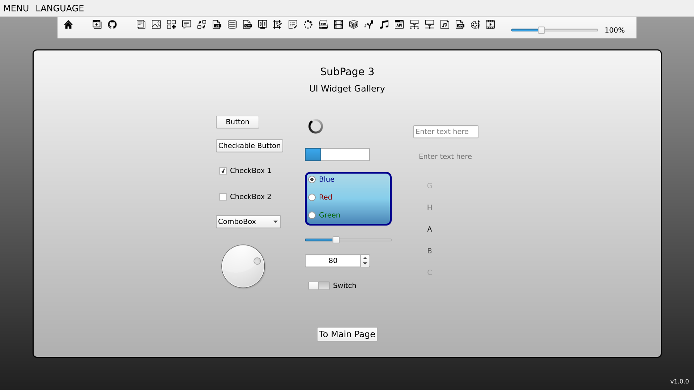

# CppQtQuickWebsite

This project demonstrates how to use **Qt** and **Emscripten** to create a web application using **C++** and **QML**, compile it to **WebAssembly**, and make it accessible on any device capable of running modern web browsers. The application features a graphical interface resembling typical interactive websites.

The subpages (described in [SubPagesDescriptions.qml](client-side/src/qml/singletons/SubPagesDescriptions.qml)) showcase many functionalities offered by **Qt** that are available for **WebAssembly**.

You can use this codebase as a template for your own projects.



## ✅ Requirements

- **C++ Compiler:**
  - for 🐧 Linux: **GCC**
  - for 🪟︎ Windows: **LLVM-MinGW**
  - for 🌐 WebAssembly: **[emscripten](https://emscripten.org/docs/getting_started/downloads.html)** version `3.1.56`
- **[CMake](https://cmake.org/download/)** version >= `3.30.2`
- Build system:
  - on 🐧 Linux: **Make**
  - on 🪟︎ Windows: **[Ninja](https://github.com/ninja-build/ninja/releases)** version >= 1.12.1 (add to *PATH*)
- **[Qt](https://www.qt.io/download-open-source)** version `6.8.0` with pre-built binaries for:
  - for 🐧 Linux: **GCC**
  - for 🪟︎ Windows: **LLVM-MinGW**
  - for 🌐 WebAssembly: (multi-threaded)


## 💻 Environment Setup

### 🐧 Linux

#### Native

```
export QT_BIN_GCC="$HOME/Qt/6.8.0/gcc_64"
```

#### For WebAssembly

```
export QT_BIN_WASM_MT="$HOME/Qt/6.8.0/wasm_multithread"

git clone https://github.com/emscripten-core/emsdk.git
cd emsdk
./emsdk install 3.1.56
./emsdk activate 3.1.56
source emsdk_env.sh
```

### 🪟︎ Windows

_TIP: `setx` sets permanent system environment variables. They are available in all NEW terminal instances. To set temporary variables that are available only in the current terminal instance, use `set` instead._

#### Native

Select **LLVM-MinGW** in the **Qt Maintenance Tool** (under Qt -> Developer and Designer Tools).

```
setx PATH "%PATH%;"%USERPROFILE%\Qt\Tools\llvm-mingw1706_64\bin"

setx QT_BIN_LLVM_MINGW "%USERPROFILE%\Qt\6.8.0\llvm-mingw_64"

setx PATH "%QT_BIN_LLVM_MINGW%\bin;%PATH%"
setx QML2_IMPORT_PATH "%QT_BIN_LLVM_MINGW%\qml"
setx QT_PLUGIN_PATH "%QT_BIN_LLVM_MINGW%\plugins"
```

#### For WebAssembly

```
setx QT_BIN_WASM_MT "%USERPROFILE%\Qt\6.8.0\wasm_multithread"

setx PATH "%QT_BIN_WASM_MT%\bin;%PATH%"
setx QML2_IMPORT_PATH "%QT_BIN_WASM_MT%\qml"
setx QT_PLUGIN_PATH "%QT_BIN_WASM_MT%\plugins"

git clone https://github.com/emscripten-core/emsdk.git
cd emsdk
emsdk.bat install 3.1.56
emsdk.bat activate --permanent 3.1.56
```

Instead of using the `--permanent` option you can run this script each time you open a new shell instance, to set up a temporary set of environment variables:
```
emsdk_env.bat
```

## 🌐 Build for WebAssembly

### On Linux

```
cd CppQtQuickWebsite/client-side
mkdir build_wasm && cd build_wasm
"$QT_BIN_WASM_MT/bin/qt-cmake" ..
"$QT_BIN_WASM_MT/bin/qt-cmake" --build .
```

#### Run

```
"$EMSDK/upstream/emscripten/emrun" --browser=chrome WebApplication.html
```

### On Windows

```
cd CppQtQuickWebsite/client-side
mkdir build_wasm && cd build_wasm
"%QT_BIN_WASM_MT%\bin\qt-cmake.bat" -G "Ninja" ..
cmake --build .
```

#### Run

```
"%EMSDK%/upstream/emscripten/emrun" WebApplication.html
```


## 🐧 Build for Linux

### On Linux

```
cd CppQtQuickWebsite/client-side
mkdir build_linux && cd build_linux
"$QT_BIN_GCC/bin/qt-cmake" ..
"$QT_BIN_GCC/bin/qt-cmake" --build .
```

#### Run

```
./WebApplication
```

## 🪟︎ Build for Windows

### On Windows

```
cd CppQtQuickWebsite/client-side
mkdir build_win && cd build_win
"%QT_BIN_LLVM_MINGW%\bin\qt-cmake.bat" -G "MinGW Makefiles" ..
cmake --build .
```

#### Run
```
WebApplication.exe
```

# 📜 Documentation

- Qt
  - [Qt 6](https://doc.qt.io/qt.html)
  - [QML Book](https://www.qt.io/product/qt6/qml-book)
- WebAssembly
  - [WASM](https://developer.mozilla.org/en-US/docs/WebAssembly)
  - [Emscripten](https://emscripten.org/docs/)
