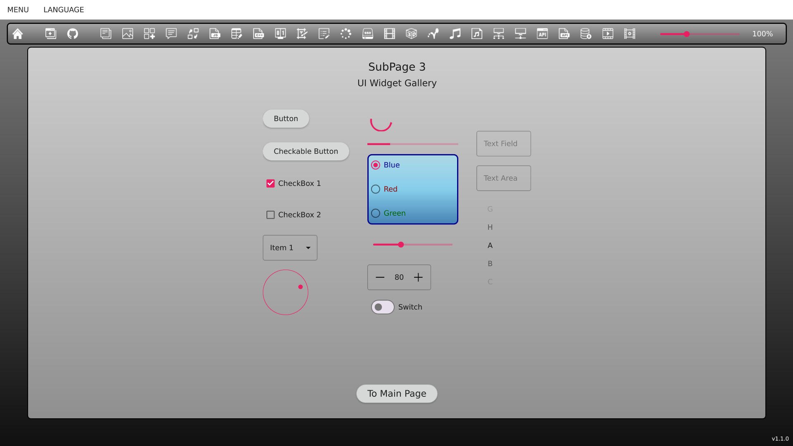
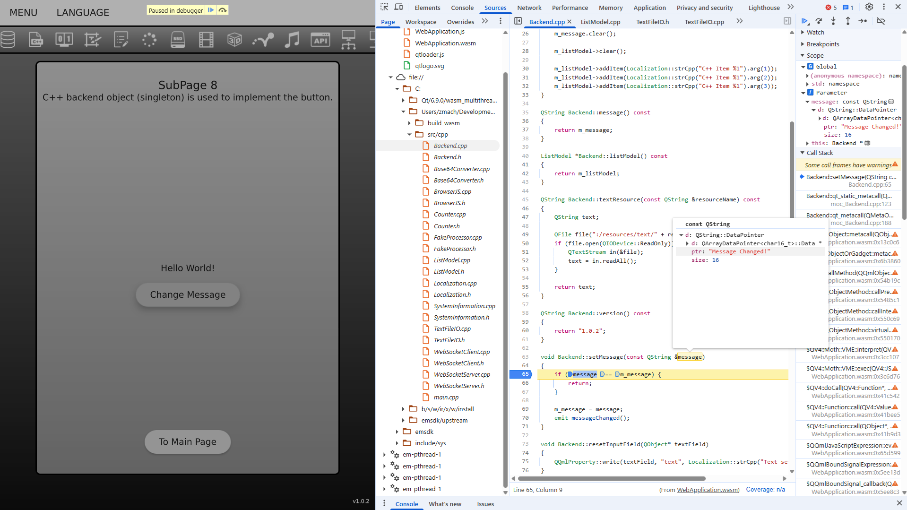

# CppQtQuickWebsite

**Live at: [machnik.github.io/cpp_qt_quick/](https://machnik.github.io/cpp_qt_quick/)**

This project demonstrates how to use **Qt** and **Emscripten** to create a web application using **C++** and **QML**, compile it to **WebAssembly**, and make it accessible on any device capable of running modern web browsers. The application features a graphical interface resembling typical interactive websites.

The subpages (described in [SubPagesDescriptions.qml](client-side/src/qml/singletons/SubPagesDescriptions.qml)) showcase many functionalities offered by **Qt** that are available for **WebAssembly**.

You can use this codebase as a template for your own projects.



## ✅ Requirements

- **C++ Compiler:**
  - for 🐧 Linux: **GCC**
  - for 🪟︎ Windows: **LLVM-MinGW**
  - for 🌐 WebAssembly: **[emscripten](https://emscripten.org/docs/getting_started/downloads.html)** version `3.1.56`
- **[CMake](https://cmake.org/download/)** version >= `3.30.2` (add to *PATH*)
- Build system:
  - on 🐧 Linux: **Make**
  - on 🪟︎ Windows: **[Ninja](https://github.com/ninja-build/ninja/releases)** version >= 1.12.1 (add to *PATH*)
- **[Qt](https://www.qt.io/download-open-source)** version `6.8.0` with pre-built binaries for:
  - for 🐧 Linux: **GCC**
  - for 🪟︎ Windows: **LLVM-MinGW**
  - for 🌐 WebAssembly - choose one:
    - single-threaded (better compatibility and stability)
    - multi-threaded (allows using C++ threads)

_TIP: **CMake**, **Ninja** and **LLVM-MinGW** can be installed on Windows using the official **Qt Maintenance Tool** (installer)._

## 💻 Environment Setup

### 🐧 Linux

#### Native

```bash
export QT_BIN_GCC="$HOME/Qt/6.8.0/gcc_64"
```

#### For WebAssembly

```bash
# Either single-thread:
export QT_BIN_WASM="$HOME/Qt/6.8.0/wasm_singlethread"
# ... or multi-thread:
export QT_BIN_WASM="$HOME/Qt/6.8.0/wasm_multithread"

git clone https://github.com/emscripten-core/emsdk.git
cd emsdk
./emsdk install 3.1.56
./emsdk activate 3.1.56
source emsdk_env.sh
```

### 🪟︎ Windows

_TIP: `setx` sets permanent system environment variables. They are available in all NEW terminal instances. To set temporary variables that are available only in the current terminal instance, use `set` instead._

#### Native

Select **LLVM-MinGW** in the **Qt Maintenance Tool** (under Qt -> Developer and Designer Tools).

```bat
setx PATH "%PATH%;"%USERPROFILE%\Qt\Tools\llvm-mingw1706_64\bin"

setx QT_BIN_LLVM_MINGW "%USERPROFILE%\Qt\6.8.0\llvm-mingw_64"

setx PATH "%QT_BIN_LLVM_MINGW%\bin;%PATH%"
setx QML2_IMPORT_PATH "%QT_BIN_LLVM_MINGW%\qml"
setx QT_PLUGIN_PATH "%QT_BIN_LLVM_MINGW%\plugins"
```

#### For WebAssembly

```bat
:: Either single-thread:
setx QT_BIN_WASM "%USERPROFILE%\Qt\6.8.0\wasm_singlethread"
:: ... or multi-thread:
setx QT_BIN_WASM "%USERPROFILE%\Qt\6.8.0\wasm_multithread"

setx PATH "%QT_BIN_WASM%\bin;%PATH%"
setx QML2_IMPORT_PATH "%QT_BIN_WASM%\qml"
setx QT_PLUGIN_PATH "%QT_BIN_WASM%\plugins"

git clone https://github.com/emscripten-core/emsdk.git
cd emsdk
emsdk.bat install 3.1.56
emsdk.bat activate --permanent 3.1.56
```

Instead of using the `--permanent` option you can run this script each time you open a new shell instance, to set up a temporary set of environment variables:
```bat
emsdk_env.bat
```

## 🌐 Build for WebAssembly

### C++ Exceptions

To enable C++ exceptions (disabled by default), in _CMakeLists.txt_ switch this option to `ON`:
```cmake
option(ENABLE_WASM_EXCEPTIONS "Enable C++ exceptions in WebAssembly builds" OFF)
```


### On Linux

```bash
cd CppQtQuickWebsite/client-side
mkdir build_wasm && cd build_wasm
# Build types are Debug and Release:
"$QT_BIN_WASM/bin/qt-cmake" -DCMAKE_BUILD_TYPE=Debug ..
"$QT_BIN_WASM/bin/qt-cmake" --build .
```

#### Run

```bash
"$EMSDK/upstream/emscripten/emrun" --browser=chrome WebApplication.html
```

### On Windows

```bat
cd CppQtQuickWebsite/client-side
mkdir build_wasm && cd build_wasm
:: Build types are Debug and Release:
"%QT_BIN_WASM%\bin\qt-cmake.bat" -G "Ninja" -DCMAKE_BUILD_TYPE=Debug ..
cmake --build .
```

#### Run

```bat
"%EMSDK%/upstream/emscripten/emrun" --browser=chrome WebApplication.html
```


## 🐧 Build for Linux

### On Linux

```bash
cd CppQtQuickWebsite/client-side
mkdir build_linux && cd build_linux
# Build types are Debug and Release:
"$QT_BIN_GCC/bin/qt-cmake" -DCMAKE_BUILD_TYPE=Debug ..
"$QT_BIN_GCC/bin/qt-cmake" --build .
```

#### Run

```bash
./WebApplication
```

## 🪟︎ Build for Windows

### On Windows

```bat
cd CppQtQuickWebsite/client-side
mkdir build_win && cd build_win
:: Build types are Debug and Release:
"%QT_BIN_LLVM_MINGW%\bin\qt-cmake.bat" -G "MinGW Makefiles" -DCMAKE_BUILD_TYPE=Debug ..
cmake --build .
```

#### Run
```bat
WebApplication.exe
```


## 🐛 Debugging the WebAssembly build in the web browser

1. Build the project for debugging (`DCMAKE_BUILD_TYPE=Debug`).  
2. For the best experience use the **Google Chrome** browser.  
3. **JavaScript** code can be debugged using **Chrome DevTools** (F12) as usual.  
4. To debug **C++** code:  
   1. Install the [C/C++ DevTools Support (DWARF)](https://goo.gle/wasm-debugging-extension) extension in Chrome.  
   2. **C++** code can now also be debugged using **Chrome DevTools** (F12), just like **JavaScript** code:  


# 📄 Publishing the website

The build process generates many files in the output directory, of which only a few have to be uploaded to a server. This website is very interactive, but its logic runs on the client's side (in the web browser) - therefore, it can be deployed on very simple hosting services, like **GitHub Pages**.


## Files to deploy

- _favicon.ico_
- _qtloader.js_
- _qtlogo.svg_
- _WebApplication.js_
- _WebApplication.html_
- _WebApplication.wasm_
- _WebApplication.worker.js_

Rename _WebApplication.html_ to _index.html_ for a simpler website URL.

The content of _qtlogo.svg_ can be modified to contain a custom splash image.

## GitHub Pages

1. Create a new **GitHub** repository.
2. Push the aforementioned files there.
3. Open the repo's page on **GitHub**.
4. Go to **Settings** -> **Pages**.
5. Set **Source** to _Deploy from branch_.
6. Set **Branch** to _main / (root)_. 
7. The website will be online within a few minutes, accessible through the displayed URL.

### Multithreading

If you are using _wasm_multithread_ binaries, sharing memory via `SharedArrayBuffer` must be allowed by setting proper COEP and COOP policies in HTTP headers. This is currently not directly possible in **GitHub**, but there is a workaround:
1. Add _[shared_array_buffer_fix.js](client-side/src/js/shared_array_buffer_fix.js)_ to the deployed files.
2. Reference it in _WebApplication.html_ (renamed to _index.html_):
   ```html
   <title>WebApplication</title>
   <script src="shared_array_buffer_fix.js"></script>
   ```

# ⏩ Roadmap

## ➕ Ideas for new features

- Better clipboard support: Use mouse for cut, copy and paste. See [Qt WebAssembly clipboard](https://www.qt.io/blog/qt-webassembly-clipboard).
- Mobile UI version for smartphones (horizontal layout?).
- Video playback using the browser's JavaScript engine.
- Text to speech (Qt Speech and/or JavaScript Web Speech API).
- Accessibility: Support for screenreaders.

## ❗ Known issues

- WebSocket server is currently not functional in the WASM build.
- Qt Multimedia doesn't seem to work with WASM, even though it did in earlier Qt 6 versions.
- 3D views do not always automatically get keyboard focus.

# 📜 Documentation

- Qt
  - [Qt 6](https://doc.qt.io/qt.html)
  - [QML Book](https://www.qt.io/product/qt6/qml-book)
  - [Overview - QML and C++ Integration](https://doc.qt.io/qt-6/qtqml-cppintegration-overview.html)
- WebAssembly
  - [WASM](https://developer.mozilla.org/en-US/docs/WebAssembly)
  - [Roadmap](https://webassembly.org/features/)
  - [Emscripten](https://emscripten.org/docs/)
